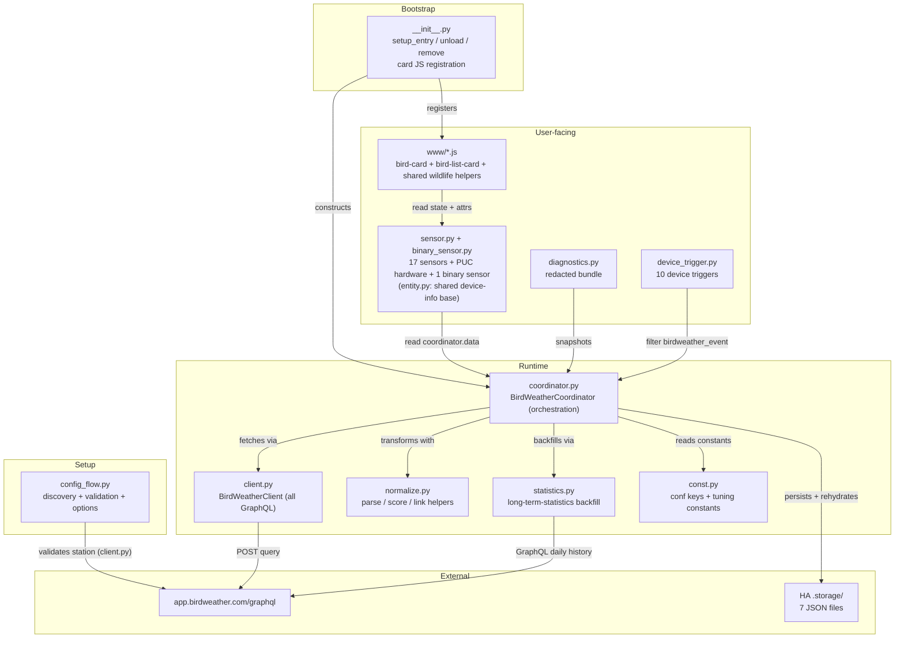
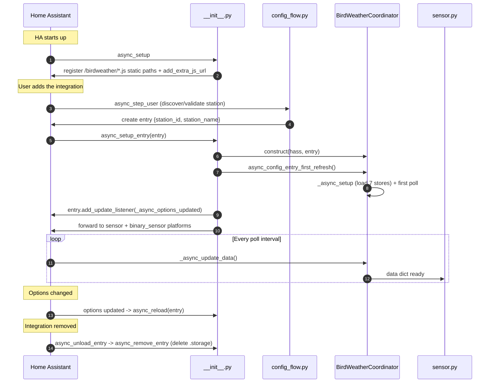

# Architecture

How the integration is structured internally: what each module does, how data
moves through it, what state lives where, and what runs when.

For external API behaviour see [docs/api.md](api.md); for the sensor contract see
[docs/sensors.md](sensors.md).

## Component map



## File layout

```text
custom_components/birdweather/
├── __init__.py           # setup + teardown; card static path + registration; options reload
├── binary_sensor.py      # extended-silence problem binary sensor
├── client.py             # BirdWeatherClient: all GraphQL (discovery + poll + history)
├── config_flow.py        # config flow (station discovery) + options flow
├── const.py              # domain, conf keys, tuning constants, event/trigger names
├── coordinator.py        # BirdWeatherCoordinator: the poll orchestration
├── device_trigger.py     # species, bat-detection and bat-behavior device triggers
├── diagnostics.py        # redacted state dump
├── entity.py             # BirdWeatherEntity: shared device-info base for the platforms
├── manifest.json         # HACS manifest (version stamped on release)
├── normalize.py          # pure response parsing, rarity/notability scoring, link URLs
├── statistics.py         # long-term-statistics backfill (recorder external statistics)
├── sensor.py             # 17 sensors + conditional PUC hardware sensors
├── strings.json          # translation keys -> display names
├── translations/
│   └── en.json
├── brand/                # logo/icon
└── www/
    ├── birdweather-bird-card.js     # single-identification card
    ├── birdweather-details-card.js  # ranked list card
    └── birdweather-wildlife.js      # shared filtering, identity and bat presentation
```

## The coordinator orchestrates; supporting modules do the work

The poll orchestration lives in [`coordinator.py`](../custom_components/birdweather/coordinator.py)
— it sequences a poll, holds the in-memory/persisted state, and builds the output
dict. The reusable pieces are separate modules it imports:

- **`client.py`** — `BirdWeatherClient` owns *all* GraphQL (discovery, the poll
  queries, and the daily-history query), so every network call is in one place
  and is unit-tested against a fake session.
- **`normalize.py`** — pure functions: dt parsing, the confidence band, window
  filters, per-species normalisation, rank / rarity / notability scoring, and the
  reference-link URL builders. No coordinator or HA state.
- **`statistics.py`** — the long-term-statistics backfill; the recorder imports
  stay lazy inside it. The coordinator calls it through a thin wrapper.

Sensors are dumb projections — they read `self.coordinator.data` and never call
the API or hold state. Both platforms share a device-info base in `entity.py`.
The config flow validates a station and stores it; it doesn't talk to the
coordinator.

### Inside `_async_update_data`

The one-time store load runs earlier, in `_async_setup` (the DataUpdateCoordinator
setup hook, invoked once before the first refresh), so the poll body has no
"loaded yet?" guard. The poll is **strictly sequential** (no `asyncio.gather`),
which keeps the data dependencies explicit: the rarity baseline (refreshed once a
day) must exist before rarity scoring; the 24-hour normalisation feeds the
fresh-install `seen_species` bootstrap before the recent-window new-species loop;
the notability pass is last so its recency component has the full 24-hour list.

### Why everything funnels through one dict

The coordinator returns a single `dict[str, Any]` per poll; most keys mirror
sensor IDs. The deliberate exceptions: singular records (`last_detection`,
`notable_detection`, `new_detection`) vs their plural lists; `recent_events` (the
per-event buffer behind `last_detection`); `last_bat_detection` and its
`bat_events` list; and `lifetime_species_count` (a scalar on `new_species`). This
key set is the contract between coordinator and sensors;
adding a sensor means adding one dict key and one sensor class that agree on the
name.

### Bat identity and event processing

The client preserves BirdWeather's `species_id`, `detection_id` and
`classification` alongside display names. Feed normalization and event
deduplication prefer those IDs when present, so an empty eBird code does not
merge all bats together. Species metadata includes `avian` or `bat`
classification; bird-reference links are suppressed for bats. The API supplies
no taxonomic rank, and the integration does not infer one.

Event metadata includes behavior, behavior code, behavior confidence and a
shortlist of alternative identifications with weights. A grouped record takes
these fields from its latest event. Shortlist candidates never become extra
detections or additional species counts.

The client fetches at most 300 recent detections in three cursor pages of up to
100. It stops on empty or non-progressing pages and invalid/repeated cursors.
The coordinator derives its recent and daily feed windows from that bounded
sample. Station-wide aggregates continue to use BirdWeather's native queries;
the new bat-only sensors do not narrow their scope.

Bat events have a separate 50-event cache. `_update_bats` compares incoming
event timestamps and IDs against a persisted watermark, saves the new state,
then emits eligible events. First setup establishes the watermark silently.
Repeated detections do not replay on later polls or restarts; unseen newer
events can still alert. Both generic and behavior triggers use identification
confidence for `alert_min_confidence`. The sample limit means events can be
missed between polls, so this is not a complete event-delivery log.

## State and persistence

The coordinator holds three categories of state:

### 1. Volatile (rebuilt every poll)
The 1-hour recent list, the 24-hour daily list, the notability ranking, today's
top species — all recomputed from the current detection feed + overview.

### 2. Daily-cached in memory
The rarity baseline (`topSpecies`), the diel histogram, and the
statistics-imported date — each refreshed once per calendar day and kept between
polls.

### 3. Persisted (`.storage/`, seven files per station)

| Store | Rehydrated by | Contents |
|---|---|---|
| `birdweather.<id>.seen_species` | `_async_setup` | lifetime first-seen log (the precious one) |
| `birdweather.<id>.last_seen` | `_async_setup` | species → most recent timestamp (hot; written most polls) |
| `birdweather.<id>.yearly` | `_async_setup` | the rarity baseline ranks |
| `birdweather.<id>.seven_day` | `_async_setup` | per-day records for the 7-day `rarest_species` window (hot) |
| `birdweather.<id>.recent_events` | `_async_setup` | rolling 50-event buffer behind `last_detection` (hot) |
| `birdweather.<id>.bat_events` | `_async_setup` | independent 50-bat-event buffer, alert watermark and event IDs at the watermark |
| `birdweather.<id>.species_meta` | `_async_setup` | species identity/classification metadata and cold lookup maps (codes, scientific names, images, attribution, links) |

Each store is written only when its data changes, gated by a dirty flag. The
split is deliberate: HA's `Store` rewrites the whole file on any change, so the
hot stores (`last_seen`, `seven_day`, `recent_events`, `bat_events`) and the
`seen_species` log are kept apart from the cold per-species maps, which
change only when a new species is first seen and so share one `species_meta`
store (one write instead of five). There is no on-disk media cache: wildlife
photos are remote BirdWeather CDN URLs the cards load directly, and audio streams
the soundscape clip in the browser.

The bat cache is independent of the combined event buffer, so daytime birds
cannot evict the last bat. It retains raw events while the displayed view
applies the current feed-confidence and audio options. The watermark advances
even for events below the alert threshold, preventing a later options change
from replaying them.

### Store migrations
On first load after upgrade, `_load_stores` migrates the five legacy per-map
stores into `species_meta` (then removes them) and cleans up the legacy `.sticky`
store (superseded by the event buffer + live notable). `async_remove_entry`
deletes all of a station's stores, including `bat_events` and the legacy files,
when the entry is removed.

## Lifecycle



### Minimum HA version

`hacs.json` pins a minimum of **Home Assistant 2025.4**. The binding requirement
is the recorder statistics API the long-term-statistics backfill uses
([`statistics.py`](../custom_components/birdweather/statistics.py)):
`StatisticMeanType` and the `mean_type` field on `StatisticMetaData` landed in
**2025.4.0**, and the lazy import would fail on older cores. (`unit_class=None` is
a harmless extra key before it became a defined field in 2025.11.)

## Custom cards

Two cards live in `www/` and register automatically in `async_setup`:
`birdweather-bird-card` (single-identification tile, with an ⓘ button that opens the
detail view) and `birdweather-bird-list-card` (ranked list with tap-to-expand
rows, confidence chips, Wikipedia descriptions, a diel sparkline, reference-link
buttons, and an optional play-the-call button). They read sensor state over HA's
WebSocket without calling the coordinator, and are versioned via the `?v=`
query string so a browser picks up new JS after an upgrade.

The cards are maintained in this repository. They share classification filters,
stable identity helpers, bat placeholders, behavior labels and shortlist
rendering through `birdweather-wildlife.js`. The former Haikubox synchronization
script has been removed. See [docs/cards.md](cards.md) and
[ADR 0001](../adr/0001-maintain-wildlife-cards-in-this-fork.md) for the
maintenance trade-off.

Audio uses the original BirdWeather soundscape URL. A tested BAT PUC recording
was 250 kHz FLAC. The cards do not perform time expansion or frequency shifting;
native ultrasonic playback may be inaudible or unsupported.

## Automation events

The coordinator fires one bus event, `birdweather_event`, for noteworthy
detections, distinguished by a `type` field. The ten types are `new_species`,
`unusual_visitor`, `watched_species`, `bat_detected` and six bat behavior codes
listed in [automations.md](automations.md). [`device_trigger.py`](../custom_components/birdweather/device_trigger.py)
exposes them as device triggers by delegating to the core event-trigger
platform, filtered to this device's `birdweather_event` of the requested type.
The four blueprints under `blueprints/automation/birdweather/` are worked
examples; see [docs/automations.md](automations.md).

## Design choices worth knowing

- **Single coordinator, all entities.** Every sensor and the binary sensor share
  one `DataUpdateCoordinator`; updating any one refreshes them all (handy for the
  custom-cadence pattern in [advanced.md](advanced.md)).
- **`_unrecorded_attributes = {"detections"}`** on every sensor — the lists can
  run to 50+ records with metadata; persisting them on every state change would
  bloat the recorder DB. They stay on the live state object for cards.
- **`last_detection` persists, `notable_species` drains.** `last_detection` is
  backed by a persisted rolling event buffer (survives restarts/outages);
  `notable_species` is a live 24-hour observation window that drains to `unknown`
  in silence — a deliberate connectivity signal (#62).
- **True counts over the sampled feed.** Volume/diversity/momentum sensors use
  BirdWeather's native per-period aggregates, not the detection feed, which is a
  recency-ordered sample and would distort distributions.
- **Options reload, not just refresh.** An options change reloads the entry so
  construction-time settings (the poll interval) take effect, not only per-poll
  ones.
- **Cards read state, not the coordinator** — so a card's YAML is portable
  between HA instances as long as the sensors exist.
